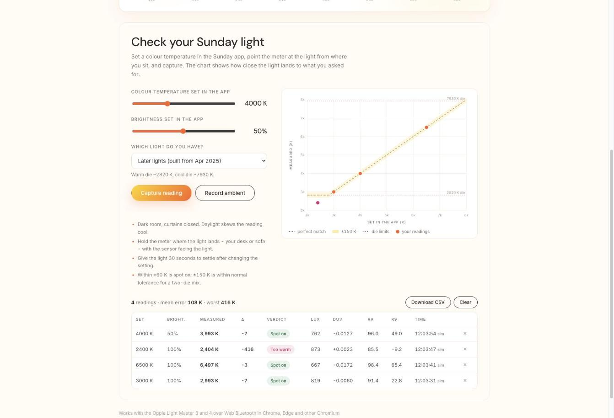

<p align="center">
  
</p>

<h1 align="center">Sunday Light Meter</h1>

<p align="center">
  A light meter in your browser. Connect an <b>Opple Light Master 3 or 4</b> over Web Bluetooth and read lux, colour temperature, Duv, tint, CRI (Ra and R1-R14), melanopic lux and circadian stimulus live - then check how accurately a <a href="https://sundaylight.cc">Sunday</a> light hits the colour you set in the app.
</p>

<p align="center">
  <a href="https://natmart-in.github.io/sunday-light-meter/"><b>Open the meter</b></a> ·
  <a href="https://natmart-in.github.io/sunday-light-meter/?demo=1">try it with a simulated meter</a>
</p>

<p align="center"><em>A side project from Sunday, largely vibe-coded and not officially supported. Issues and PRs welcome on this repo. Not affiliated with Opple.</em></p>

## What it does

- Talks to the meter directly from the page - no app, no server, nothing leaves your browser.
- Uses the meter's own factory calibration (the `kSensor` factors it stores) and the same maths as the Opple app, so the numbers match what the app would show.
- Supports both generations: the six-band **Light Master 3** and the AS7341-based **Light Master 4**, detected automatically.
- **Check your Sunday light**: set a colour temperature and brightness in the Sunday app, capture an averaged reading, and see the error against the setting on a chart and in a table. Readings persist in the browser and export to CSV.

## Using it

1. Open the page in **Chrome or Edge** (desktop or Android). Safari and Firefox do not support Web Bluetooth; on iPhone/iPad use the [Bluefy](https://apps.apple.com/app/bluefy-web-ble-browser/id1492822055) browser.
2. Wake the meter (press its button) and close the Opple app - the meter accepts one Bluetooth connection at a time.
3. Press **Connect light meter** and pick the meter in the browser dialog. A Light Master 4 shows up as `SigMesh`; a Light Master 3 as `Opple` or similar.
4. Readings stream twice a second. The disc glows with the measured colour; the bars underneath are the raw sensor bands.

| Reading | Meaning |
| --- | --- |
| Colour temperature (K) | Correlated colour temperature, McCamy's formula on the CIE 1931 chromaticity |
| Lux | Illuminance at the sensor |
| Duv | Distance from the black-body line. Negative = magenta/pink, positive = green |
| Tint | The same idea on a camera-style scale (Adobe DNG) |
| CRI Ra, R1-R14 | Colour rendering. R9 is saturated red, the one LEDs usually fail |
| Melanopic (EML) | Equivalent melanopic lux, the light's effect on the circadian system |
| Circadian CS | Rea circadian stimulus (Light Master 4 only) |

## Checking a Sunday light

Sunday lights mix a warm and a cool LED die to make the colour you ask for. This tool tells you how close the mix lands.

1. Darken the room - daylight leaking in reads cool and skews the result.
2. Set a colour temperature and brightness in the Sunday app and give the light 30 seconds to settle.
3. Hold the meter where the light lands (your desk, the sofa) with the sensor facing the light. Enter the same setting on the page and press **Capture reading**. The page averages eight samples over about four seconds.
4. Optional: with the light off, press **Record ambient** so dim readings dominated by room light get flagged.

Verdicts: within **±60 K** is spot on, within **±150 K** is normal tolerance for a two-die mix, beyond that the light is reading too warm or too cool. "Too dim" means under 30 lux reached the sensor - move closer.

The light cannot go warmer than its warm die or cooler than its cool die, so a setting outside that range is expected to clamp. Tell the page which light you have and it will judge against the clamped value and draw the die limits on the chart:

| Light | Warm die | Cool die |
| --- | --- | --- |
| Earlier lights (built up to Feb 2025) | ~2720 K | ~6900 K |
| Later lights (built from Apr 2025) | ~2820 K | ~7930 K |

Not sure which you have? Set the app to its warmest and coolest settings and measure both - those two readings are your light's die limits.

<p align="center"></p>

## How the numbers are calculated

Both meters report raw counts per spectral band plus a per-unit calibration vector (`kSensor`) that the page reads over Bluetooth on connect and multiplies in before any colour maths.

**Light Master 3** - six bands (450/500/550/570/600/650 nm). The source type is classified (monochromatic, incandescent, general) and the matching 3x7 tristimulus matrix gives XYZ; Y is lux. CRI is estimated from a natural cubic spline through the six bands (CIE 13.3-1995), EML from Opple's band fit. These are the matrices and rules reverse-engineered by [open-light-master](https://github.com/OlliV/open-light-master); the JavaScript port is checked against Sunday's Python bench implementation of the same maths to 1e-9 in `test/colour.test.js`.

**Light Master 4** - eight AS7341 bands (415/445/480/515/555/590/630/680 nm) plus a clear channel. XYZ comes from the single 3x8 matrix the official Opple app uses (`LightmasterIVCoeff_20231115`, app v3.15.0), and CRI/EML/CS from the app's degree-3 polynomial model on the normalised bands. Both were extracted from the app by [opple-bridge](https://github.com/gabrielebaudo/opple-bridge) (MIT). On a real probe the page reads 4239 K / Ra 96.5 / R9 52.4 where the app showed 4236 K / 96.5 / 52.2. If a spectrum falls outside the model's domain the page falls back to the spline CRI and says so in the Ra tooltip.

Shared formulas: CIE 1931 xy and 1960 uv, McCamy CCT, Ohno (2014) Duv polynomial (ANSI C78.377), DNG-style tint, CIE 13.3 CRI with Planckian (< 5000 K) or D-illuminant references.

Caveats: CRI from six or eight bands is an estimate, not a spectroradiometer result - treat Ra to a couple of points and R9 loosely. Readings under a few lux are noise. McCamy is accurate roughly 2000-12500 K.

## Putting it on sundaylight.cc

The build produces a self-contained Shopify section in `dist/sunday-light-meter.liquid` (styles and script inline, scoped under `.slm`, using the theme's `--sunday-heading` / `--sunday-body` fonts).

1. Copy `dist/sunday-light-meter.liquid` into the theme's `sections/` folder.
2. Add a page template, e.g. `templates/page.light-meter.json`:

   ```json
   {
     "sections": {
       "page-hero": { "type": "sunday-page-hero", "settings": { "color_scheme": "scheme-1", "sky_wash": true, "heading": "Light meter", "subtitle": "<p>Measure the light you actually get.</p>" } },
       "meter": { "type": "sunday-light-meter", "settings": { "color_scheme": "scheme-1", "heading": "" } }
     },
     "order": ["page-hero", "meter"]
   }
   ```

3. In Shopify admin create a page (e.g. `/pages/light-meter`) and give it the `light-meter` template.

Web Bluetooth needs an https page (Shopify is) and a click to start - both satisfied by the section as generated. If you would rather not touch the theme, an iframe works too as long as it is allowed to use Bluetooth: `<iframe src="https://natmart-in.github.io/sunday-light-meter/" allow="bluetooth" ...>`.

## Development

No dependencies. Plain ES modules, tested with Node's built-in runner.

```bash
npm test          # maths and protocol tests
npm run build     # regenerates dist/ (committed; CI fails if it is stale)
npm run serve     # http://localhost:8080/?demo=1 for a simulated meter
```

| File | What |
| --- | --- |
| `src/protocol.js` | NUS framing, fragment reassembly, LM3/LM4 payload parsing |
| `src/meter.js` | Web Bluetooth session: connect, read calibration, poll, reconnect |
| `src/colour.js` | Chromaticity, CCT, Duv, tint, spline SPD, CRI, battery, display colours |
| `src/lm3.js` / `src/lm4.js` | Per-meter pipelines (matrices, mode logic, Opple's LM4 polynomial model) |
| `src/cie-data.js` / `src/lm4-model-data.js` | Generated data tables - do not hand-edit |
| `src/app.js` / `src/style.css` | The page |
| `scripts/build.mjs` | Inlines everything into `dist/index.html` and the Shopify section |

### Protocol notes

Nordic UART service `6e400001-b5a3-f393-e0a9-e50e24dcca9e`. Commands are written to the notify characteristic `…0003` (the meter accepts this; the app does the same) and answers come back on it. Message = 11-byte header `[0, 0x13, 0, 0, seq, 0, bodyLen, 0, 0, opHi, opLo]` + body, wrapped in fragments whose first byte is `0x00` single / `0x80` first / `0xA0|i` middle / `0xC0|i` last. Opcodes: `0x0A00` measure → `0x0A01`, `0x0A04` read calibration → `0x0A05`. Measurement payload after the header: LM3 `[skip][6 x u16 BE][battery mV u16][temp]`; LM4 `[skip][9 x u16 BE][2 pad][battery raw u16]` - the length tells the models apart. Calibration: `float32 LE` factors from payload byte 1, seven for the LM3 and nine for the LM4.

## Credits

- [OlliV/open-light-master](https://github.com/OlliV/open-light-master) - reverse-engineered the Light Master 3 protocol and maths.
- [gabrielebaudo/opple-bridge](https://github.com/gabrielebaudo/opple-bridge) - Light Master 4 payload layouts and the official app's coefficients.
- [Geomaniac15/tag-tester](https://github.com/Geomaniac15/tag-tester) - Light Master 4 field notes.

MIT licence. Opple and Light Master are trademarks of their owner; this project is not affiliated with Opple.
