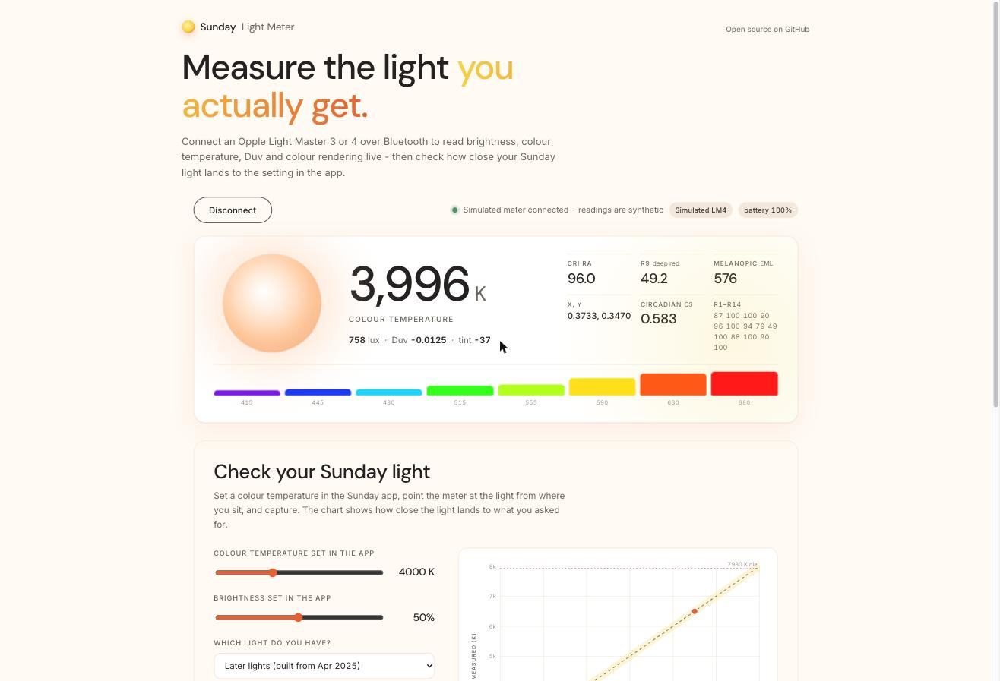

<p align="center">
  
</p>

<h1 align="center">Light Meter for the Opple Light Master 3 &amp; 4</h1>

<p align="center">
  A light meter in your browser. Connect an <b>Opple Light Master 3 or 4</b> over Web Bluetooth and read lux, colour temperature, Duv, tint, CRI (Ra and R1-R14), melanopic lux and circadian stimulus live. Log readings, export CSV. No app, no account, nothing leaves your browser.
</p>

<p align="center">
  <a href="https://sundaylight.cc/pages/light-meter"><b>Open the meter</b></a>
</p>

<p align="center"><em>Built and open-sourced by <a href="https://sundaylight.cc">Sunday Light</a>. A side project, largely vibe-coded and not officially supported - issues and PRs welcome here. Not affiliated with Opple.</em></p>

## Why

The Light Master is the light meter most lighting hobbyists own. The excellent [open-light-master](https://github.com/OlliV/open-light-master) web app only speaks to the Light Master 3 - the Light Master 4 has a different sensor and nobody had put its maths in a browser. We use Light Masters on our bench every day and wanted the readings on a laptop, so we built this and gave it away.

## What it does

- Talks to the meter directly from the page over Web Bluetooth - no server, no install.
- Uses the meter's own factory calibration (the `kSensor` factors it stores) and the same colour maths as the Opple app, so the numbers match what the app shows.
- Supports both generations: the six-band **Light Master 3** and the AS7341-based **Light Master 4**, detected automatically.
- Live readout twice a second; a disc glows with the measured colour; the bars are the raw sensor bands.
- **Reading log**: average eight samples, label it ("bedroom lamp 2700 K"), keep it in the browser, download everything as CSV including R1-R14.
- **Diagnostics** panel with a copyable connection log and a force-disconnect for a stuck meter.

## Using it

1. Open the page in **Chrome or Edge** (desktop or Android). Safari and Firefox do not support Web Bluetooth; on iPhone/iPad use the [Bluefy](https://apps.apple.com/app/bluefy-web-ble-browser/id1492822055) browser.
2. Wake the meter (press its button) and close the Opple app - the meter accepts one Bluetooth connection at a time.
3. Press **Connect light meter** and pick the meter in the browser dialog. A Light Master 4 shows up as `SigMesh`; a Light Master 3 as `Opple` or similar.
4. Readings stream. Press **Log reading** to average a few seconds and keep the result.

| Reading | Meaning |
| --- | --- |
| Colour temperature (K) | Correlated colour temperature, McCamy's formula on the CIE 1931 chromaticity |
| Lux | Illuminance at the sensor |
| Duv | Distance from the black-body line. Negative = magenta/pink, positive = green |
| Tint | The same idea on a camera-style scale (Adobe DNG) |
| CRI Ra, R1-R14 | Colour rendering. R9 is saturated red, the one LEDs usually fail |
| Melanopic (EML) | Equivalent melanopic lux, the light's effect on the circadian system |
| Circadian CS | Rea circadian stimulus (Light Master 4 only) |

### If it will not connect or keeps dropping

- The chooser only lists devices that look like a Light Master (by name or UART service) - that is why nothing else shows up. If your meter advertises under an odd name, use **Not listed? Show all devices**.
- Only one thing can hold the meter. Press **Meter stuck? Force disconnect**: it drops any link this site holds, clears the browser permission and then listens for the meter - if it is not advertising, something else still has it (the Opple app on your phone, another tab, or the meter itself). Quit the app, close other tabs, and on a Mac click the meter in the Bluetooth menu and choose Disconnect.
- Power-cycle the meter and make sure it is charged; a meter that drops the link a second or two after connecting is usually one that is asleep, flat, or still attached to something else.
- Open **Diagnostics** at the bottom of the page: every step of the connection is logged with timings and the exact error, and *Copy log* gives you something to paste into an issue.

## How the numbers are calculated

Both meters report raw counts per spectral band plus a per-unit calibration vector (`kSensor`) that the page reads over Bluetooth on connect and multiplies in before any colour maths.

**Light Master 3** - six bands (450/500/550/570/600/650 nm). The source type is classified (monochromatic, incandescent, general) and the matching 3x7 tristimulus matrix gives XYZ; Y is lux. CRI is estimated from a natural cubic spline through the six bands (CIE 13.3-1995), EML from Opple's band fit. These are the matrices and rules reverse-engineered by [open-light-master](https://github.com/OlliV/open-light-master); the JavaScript port is checked against an independent Python implementation of the same maths to 1e-9 in `test/colour.test.js`.

**Light Master 4** - eight AS7341 bands (415/445/480/515/555/590/630/680 nm) plus a clear channel. XYZ comes from the single 3x8 matrix the official Opple app uses (`LightmasterIVCoeff_20231115`, app v3.15.0), and CRI/EML/CS from the app's degree-3 polynomial model on the normalised bands. Both were extracted from the app by [opple-bridge](https://github.com/gabrielebaudo/opple-bridge) (MIT). On a real probe the page reads 4239 K / Ra 96.5 / R9 52.4 where the app showed 4236 K / 96.5 / 52.2. If a spectrum falls outside the model's domain the page falls back to the spline CRI and says so in the Ra tooltip.

Shared formulas: CIE 1931 xy and 1960 uv, McCamy CCT, Ohno (2014) Duv polynomial (ANSI C78.377), DNG-style tint, CIE 13.3 CRI with Planckian (< 5000 K) or D-illuminant references.

Caveats: CRI from six or eight bands is an estimate, not a spectroradiometer result - treat Ra to a couple of points and R9 loosely. Readings under a few lux are noise. McCamy is accurate roughly 2000-12500 K.

## Development

No dependencies. Plain ES modules, tested with Node's built-in runner.

```bash
npm test          # maths and protocol tests
npm run build     # regenerates dist/ (committed; CI fails if it is stale)
npm run serve     # http://localhost:8080/?debug=1 opens with the diagnostics log visible
```

| File | What |
| --- | --- |
| `src/protocol.js` | NUS framing, fragment reassembly, LM3/LM4 payload parsing |
| `src/meter.js` | Web Bluetooth session: connect, read calibration, poll, reconnect, diagnostics |
| `src/colour.js` | Chromaticity, CCT, Duv, tint, spline SPD, CRI, battery, display colours |
| `src/lm3.js` / `src/lm4.js` | Per-meter pipelines (matrices, mode logic, Opple's LM4 polynomial model) |
| `src/cie-data.js` / `src/lm4-model-data.js` | Generated data tables - do not hand-edit |
| `src/app.js` / `src/style.css` | The page |
| `scripts/build.mjs` | Inlines everything into `dist/index.html` and a Shopify section |

`dist/sunday-light-meter.liquid` is a self-contained Shopify theme section (styles and script inline, scoped under `.slm`) - that is how the page is embedded at [sundaylight.cc/pages/light-meter](https://sundaylight.cc/pages/light-meter). `dist/index.html` is the same thing as a standalone page.

### Protocol notes

Nordic UART service `6e400001-b5a3-f393-e0a9-e50e24dcca9e`. Commands are written to the notify characteristic `…0003` (the meter accepts this; the app does the same) and answers come back on it. Message = 11-byte header `[0, 0x13, 0, 0, seq, 0, bodyLen, 0, 0, opHi, opLo]` + body, wrapped in fragments whose first byte is `0x00` single / `0x80` first / `0xA0|i` middle / `0xC0|i` last. Opcodes: `0x0A00` measure → `0x0A01`, `0x0A04` read calibration → `0x0A05`. Measurement payload after the header: LM3 `[skip][6 x u16 BE][battery mV u16][temp]`; LM4 `[skip][9 x u16 BE][2 pad][battery raw u16]` - the length tells the models apart. Calibration: `float32 LE` factors from payload byte 1, seven for the LM3 and nine for the LM4. The Light Master 4 advertises as `SigMesh` with no service UUIDs in the advert, only Opple manufacturer data (`0x0539`) carrying its MAC.

## Credits

- [OlliV/open-light-master](https://github.com/OlliV/open-light-master) - reverse-engineered the Light Master 3 protocol and maths.
- [gabrielebaudo/opple-bridge](https://github.com/gabrielebaudo/opple-bridge) - Light Master 4 payload layouts and the official app's coefficients.
- [Geomaniac15/tag-tester](https://github.com/Geomaniac15/tag-tester) - Light Master 4 field notes.

MIT licence. Opple and Light Master are trademarks of their owner; this project is not affiliated with Opple.
